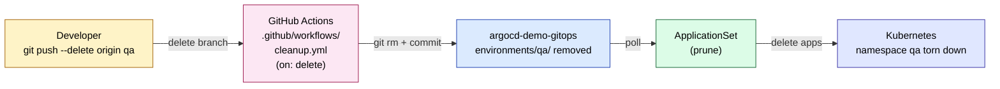

```mermaid
flowchart LR
    Dev["Developer<br/>git push origin qa"]:::user
    SrcRepo["argocd-demo<br/>(this repo)"]:::repo
    CI["GitHub Actions<br/>.github/workflows/<br/>deploy.yml"]:::ci
    GitOps["argocd-demo-gitops<br/>environments/qa/<br/>{app1,app2,app3}/"]:::repo
    AppSet["ArgoCD ApplicationSet<br/>matrix: dirs × apps"]:::argo
    Apps["qa-app1 · qa-app2 · qa-app3<br/>(3 Applications)"]:::argo
    K8s["Kubernetes<br/>namespace: qa"]:::k8s

    Dev -->|push| SrcRepo
    SrcRepo -->|on push| CI
    CI -->|render + commit<br/>bump submodule| GitOps
    GitOps -->|poll| AppSet
    AppSet -->|generate| Apps
    Apps -->|sync| K8s

    classDef user fill:#fef3c7,stroke:#a16207,color:#000
    classDef repo fill:#dbeafe,stroke:#1e40af,color:#000
    classDef ci fill:#fce7f3,stroke:#9d174d,color:#000
    classDef argo fill:#dcfce7,stroke:#166534,color:#000
    classDef k8s fill:#e0e7ff,stroke:#3730a3,color:#000
```

# argocd-demo

Branch-driven GitOps on Kubernetes. Push a branch → an environment provisions itself. Delete a branch → the environment tears itself down. **Zero manual ArgoCD work after the one-time setup.**

This repo is the **source of truth** for the application code, Helm chart, raw manifests, cluster bootstrap, and the GitHub Actions pipeline. Per-environment Kubernetes manifests live in a separate repo: [`argocd-demo-gitops`](https://github.com/erchetansoni/argocd-demo-gitops) (the GitOps repo ArgoCD watches).

> **Companion repo:** all per-environment manifests live in [erchetansoni/argocd-demo-gitops](https://github.com/erchetansoni/argocd-demo-gitops). You'll need both repos to run the demo.

---

## Table of contents
- [Architecture](#architecture)
- [Branch → environment mapping](#branch--environment-mapping)
- [Repo layout](#repo-layout)
- [Prerequisites](#prerequisites)
- [Setup from scratch](#setup-from-scratch) — first-time, end-to-end
- [Working with the two repos](#working-with-the-two-repos) — sync flow, who writes what
- [Day-to-day usage](#day-to-day-usage)
- [Validation](#validation)
- [Troubleshooting](#troubleshooting)
- [Teardown — full cleanup (including AWS)](#teardown--full-cleanup-including-aws)
- [Why this shape (and what's *not* mandatory)](#why-this-shape-and-whats-not-mandatory)

---

## Architecture

### Provisioning: branch push → environment



### Teardown: branch delete → environment removed



---

## Branch → environment mapping

| Branch | Action | Environment | Namespace | Hosts |
|---|---|---|---|---|
| `main` | deploy | `production` | `main` | `app{1,2,3}.chetan.com` |
| `dev` | deploy | `development` | `dev` | `app{1,2,3}.dev.chetan.com` |
| `stage` | deploy | `stage` | `stage` | `app{1,2,3}.stage.chetan.com` |
| `it` | deploy | `information-technology` | `it` | `app{1,2,3}.it.chetan.com` |
| `qa`, `demo`, … (no `/`) | deploy | `<branch>` | `<branch>` | `app{1,2,3}.<branch>.chetan.com` |
| `feature/*`, `bug/*`, anything containing `/` | **skip** | — | — | — |

---

## Repo layout

```
.
├── apps/                      # Application source (referenced from gitops repo via submodule)
│   ├── app1/                  # Helm chart  (used by <env>-app1 Applications)
│   ├── app2/                  # Raw manifests + kustomization.yaml
│   └── app3/                  # Raw manifests + kustomization.yaml
├── aws-secrets-manager/       # AWS secret bootstrap scripts
├── k8s-cluster-setup/         # kind + nginx + ArgoCD + ESO bootstrap
├── platform/argocd/           # ArgoCD platform config (ingress, cmd-params)
└── .github/
    ├── workflows/
    │   ├── deploy.yml         # on push: render env folder + push to gitops repo
    │   └── cleanup.yml        # on branch delete: rm env folder + push
    ├── scripts/render-env.sh  # envsubst over .tpl files
    └── templates/             # one subfolder per app (app1, app2, app3)
```

The companion **gitops repo** layout (one folder per branch, written by CI):

```
argocd-demo-gitops/
├── _source/                              # submodule -> argocd-demo (advanced by CI to source HEAD)
├── applicationset.yaml                   # the only ApplicationSet
├── argocd-cm-patch.yaml                  # one-time configmap patch
└── environments/
    └── <branch>/
        ├── app1/  (kustomization.yaml + values.yaml)
        ├── app2/  (kustomization.yaml — raw + ingress patch)
        └── app3/  (kustomization.yaml — raw + ingress patch)
```

---

## Prerequisites

| Tool | Why | Version we tested with |
|---|---|---|
| [Docker](https://docs.docker.com/get-docker/) | Runs the kind cluster's nodes | recent |
| [kind](https://kind.sigs.k8s.io/docs/user/quick-start/) | Local Kubernetes | 0.20+ |
| [kubectl](https://kubernetes.io/docs/tasks/tools/) | Cluster CLI | 1.29+ |
| [helm](https://helm.sh/docs/intro/install/) | ESO chart install (called from `install-eso.sh`) | 3.13+ |
| [aws CLI](https://docs.aws.amazon.com/cli/latest/userguide/getting-started-install.html) | Pushing demo secrets to AWS Secrets Manager | 2.x |
| [git](https://git-scm.com/) | Obvious | 2.40+ |

You also need:

- An **AWS account** with permission to create/delete entries in AWS Secrets Manager (region `ap-south-1` by default — change in scripts if different).
- A **GitHub account** with the ability to create two repos and a fine-grained PAT.
- The two repos themselves: this one (`argocd-demo`) and an empty one named `argocd-demo-gitops`.

---

## Setup from scratch

This is a one-time setup. After this, pushing/deleting branches is the only thing you do.

### 1. Fork or clone both repos

```bash
# Source repo (this one)
git clone git@github.com:<you>/argocd-demo.git
cd argocd-demo

# Sibling clone of the gitops repo
git clone git@github.com:<you>/argocd-demo-gitops.git ../argocd-demo-gitops
```

If you forked, **update every reference to `erchetansoni/argocd-demo` and `erchetansoni/argocd-demo-gitops`** in:
- `.github/workflows/deploy.yml` and `cleanup.yml` — the `GITOPS_REPO` env var
- `argocd-demo-gitops/applicationset.yaml` — the `repoURL` (twice)
- `argocd-demo-gitops/.gitmodules` — the submodule URL

### 2. Create a GitHub PAT for CI to write to the gitops repo

This is the **only** secret CI needs to push commits to the GitOps repo.

**Use a fine-grained PAT** (more secure than classic). Steps:

1. Go to https://github.com/settings/personal-access-tokens/new
2. **Token name:** `argocd-demo-gitops-bot` (or anything memorable).
3. **Resource owner:** your user (or org).
4. **Expiration:** as short as you can manage (90 days max recommended).
5. **Repository access:** select **"Only select repositories"** → pick `argocd-demo-gitops`. *(You don't need to grant access to `argocd-demo`; the workflow uses GitHub's built-in `GITHUB_TOKEN` for that.)*
6. **Repository permissions** — set exactly these:

   | Permission | Access | Why |
   |---|---|---|
   | **Contents** | **Read and write** | CI commits env folders to gitops repo |
   | Metadata | Read-only *(auto)* | GitHub forces this on; harmless |

   Leave **everything else as "No access"**. Specifically:
   - ❌ Actions, Administration, Pull requests, Workflows, Webhooks, Secrets, etc. — all **No access**.

7. **Account permissions:** **leave all of them as "No access"**. The CI doesn't need anything from your account.
8. Click **Generate token** and copy the value (starts with `github_pat_…`). You won't see it again.

> **Why fine-grained over classic?** A classic PAT with `repo` scope grants full control of *every* repo you can access. Fine-grained PATs are scoped to specific repos with minimum permissions — much safer if the token is leaked.

### 3. Add the PAT as a secret in the source repo

Go to `argocd-demo` → Settings → Secrets and variables → Actions → New repository secret:

| Secret name | Value |
|---|---|
| `GITOPS_TOKEN` | The PAT from step 2 |

That's the only Actions secret needed for the new ClusterSecretStore architecture. (AWS creds are *not* in CI — they're set up directly on the cluster.)

### 4. AWS Secrets Manager — push demo secrets (cost: tiny but non-zero)

The chart's `app1` uses ESO to pull two secrets from AWS Secrets Manager. You need to populate them once.

```bash
cd aws-secrets-manager

# Create your AWS creds file (gitignored)
cp .env.example .env
# Edit .env — fill AWS_ACCESS_KEY_ID, AWS_SECRET_ACCESS_KEY, and (optional) AWS_SESSION_TOKEN

# Create your demo secrets (gitignored)
cp aws-secrets.example aws-secrets
# Edit aws-secrets — plain KEY=value lines

cp aws-secret-file.example aws-secret-file
# Edit aws-secret-file — arbitrary content (becomes file-style secret)

# Push them all to AWS
./setup-aws-secrets.sh
```

> **AWS pricing note:** AWS Secrets Manager charges **$0.40 per secret per month** + $0.05 per 10K API calls. Two demo secrets ≈ $0.80/month if left running. See [Teardown](#teardown--full-cleanup-including-aws) when you're done.

### 5. Bring up the local cluster (kind + nginx + ArgoCD + ESO)

```bash
# From the source repo root:
./k8s-cluster-setup/create-cluster.sh
```

This is one chained script; it brings up kind, NGINX ingress, ArgoCD, the ArgoCD ingress at `argocd.chetan.com`, and ESO. Wait for it to print the ArgoCD admin password — **save that**.

### 6. Configure ArgoCD for Kustomize-with-Helm

```bash
kubectl patch configmap argocd-cm -n argocd --type merge -p \
  '{"data":{"kustomize.buildOptions":"--enable-helm --load-restrictor=LoadRestrictionsNone"}}'
kubectl rollout restart deploy/argocd-repo-server -n argocd
```

### 7. Create the ESO creds Secret + ClusterSecretStore

```bash
./aws-secrets-manager/create-k8s-aws-credentials-secret.sh
```

This creates a K8s Secret in the `external-secrets` namespace and applies a `ClusterSecretStore` CR. ExternalSecrets in any namespace can use it.

> **Why this and not committing to git?** GitHub push protection blocks AWS keys from entering any repo. `ClusterSecretStore` keeps creds inside the cluster only — they never enter git.

### 8. Bootstrap the GitOps repo (one-time)

```bash
cd ../argocd-demo-gitops
git submodule add -b main https://github.com/<you>/argocd-demo.git _source

# Copy the canonical applicationset.yaml + argocd-cm-patch.yaml from this folder
# (they already exist in the argocd-demo-gitops repo if you forked it)

git add .
git commit -m "chore: bootstrap gitops repo [skip ci]"
git push -u origin main
```

### 9. Apply the ApplicationSet to the cluster

```bash
kubectl apply -f /path/to/argocd-demo-gitops/applicationset.yaml
```

The ApplicationSet polls the gitops repo, sees `environments/main/{app1,app2,app3}/`, and generates `main-app1`, `main-app2`, `main-app3`.

### 10. Add hostnames to /etc/hosts

```
127.0.0.1 argocd.chetan.com app1.chetan.com app2.chetan.com app3.chetan.com
```

For each new branch you provision, add `app{1,2,3}.<branch>.chetan.com` too.

### 11. First push to validate end-to-end

```bash
cd /path/to/argocd-demo
git checkout main
git commit --allow-empty -m "ci: first run"
git push origin main
```

Watch:
- The Actions tab on `argocd-demo` — the workflow should run and finish in ~30s.
- A new commit lands on `argocd-demo-gitops`'s `main` with message `ci(main): sync from <sha> [skip ci]`.
- After ArgoCD's next poll, `kubectl get applications -n argocd` shows `main-app1`, `main-app2`, `main-app3` as `Synced + Healthy`.

You're now done with setup. From here on, the branch lifecycle takes over.

---

## Working with the two repos

You'll have two local clones — one for `argocd-demo`, one for `argocd-demo-gitops`. Their write patterns are very different and that's where most confusion comes from.

### Who writes to what

```
                                CI commits
                                (every push)
                                     │
                                     ▼
You ──push──▶ argocd-demo ──▶ argocd-demo-gitops ──poll──▶ ArgoCD ──▶ K8s
              (source)            (state)
              ▲                    ▲
              │                    │
        you edit here         CI edits here
        most of the           almost always
        time                  (you rarely touch it)
```

| Repo | Who writes | When you should pull | When you push |
|---|---|---|---|
| `argocd-demo` (source) | **You** | Only if collaborating with others | Whenever you make a change — that's the whole point |
| `argocd-demo-gitops` | **CI** (and rarely you) | Before any local edit (CI commits constantly) | Only when you change `applicationset.yaml`, `argocd-cm-patch.yaml`, or the README |

### The 90% case: only touch the source repo

For app code changes, branch creation, branch deletion — you **never need to clone or pull the gitops repo**. The flow is one-directional:

```
your push to argocd-demo  →  CI renders + commits to gitops repo  →  ArgoCD picks it up
```

Your gitops repo on disk is stale the moment CI runs, but that's fine — you don't need it to be fresh unless you're editing it.

### The 10% case: editing the gitops repo

You only edit the gitops repo when:
- Adding/removing apps in [`applicationset.yaml`](https://github.com/erchetansoni/argocd-demo-gitops/blob/main/applicationset.yaml)
- Tweaking `argocd-cm-patch.yaml`
- Updating its README

When you do, **always pull first with rebase** because CI may have added commits since your last pull:

```bash
cd argocd-demo-gitops
git pull --rebase                      # always, before any edit
# … make your changes …
git add . && git commit -m "..."
git pull --rebase                      # again, in case CI ran while you were editing
git push
```

### Set rebase as default for the gitops repo (one-time)

Best ergonomic improvement — makes plain `git pull` always rebase in this repo, so you'll never see "divergent branches":

```bash
cd argocd-demo-gitops
git config pull.rebase true
```

Or globally for all repos (if you're comfortable with that default):

```bash
git config --global pull.rebase true
```

### Why divergent branches happen (and when they don't)

Local: you committed locally but didn't push.
Remote: CI added a commit (a sync from a branch push, or a teardown commit, or a submodule bump).

Both happened off the same parent commit → two branches off one point → divergent.

This **only happens on the gitops repo**, and only when you edit it locally. The source repo never has this problem because nothing else writes to it.

### A reasonable mental model

> Treat `argocd-demo-gitops` as a **machine-managed cache** of branch states. CI writes; ArgoCD reads. You only intervene to change the *rules* (ApplicationSet) — not the *contents* (env folders).

If you internalize this, the two-repo split feels natural rather than redundant.

---

## Day-to-day usage

### Provision a new environment

```bash
git checkout -b qa
git commit --allow-empty -m "feat(qa): provision qa environment"
git push -u origin qa
```

Within ~30s: namespace `qa` exists, `qa-app1` / `qa-app2` / `qa-app3` are `Synced + Healthy`. Add `app{1,2,3}.qa.chetan.com` to `/etc/hosts` to reach them.

### Update app code

Push to any valid branch. CI re-renders that env's folder in the gitops repo and bumps the submodule pointer to your commit. ArgoCD reconciles within its poll interval (~3 min default).

To force an immediate refresh:
```bash
kubectl annotate application <branch>-<app> -n argocd argocd.argoproj.io/refresh=hard --overwrite
```

### Tear down a single environment

```bash
git push --delete origin qa
```

`cleanup.yml` fires, removes `environments/qa/` from the gitops repo, ApplicationSet auto-prunes the three `qa-*` Applications, namespace `qa` goes away within ~30s.

---

## Validation

```bash
# Applications (one per env × app)
kubectl get applications -n argocd

# Per-namespace resources
kubectl get pods,svc,ingress,externalsecret -n main
kubectl get pods,svc,ingress,externalsecret -n qa

# ESO: creds + cluster store
kubectl get secret aws-secretsmanager-credentials -n external-secrets
kubectl get clustersecretstore aws-secretsmanager
```

---

## Troubleshooting

| Symptom | Likely cause | Fix |
|---|---|---|
| CI fails at "Checkout GitOps repo" with "couldn't find remote ref refs/heads/main" | Gitops repo is empty (no `main` branch) | Bootstrap the gitops repo (step 8) before pushing to source |
| CI fails at "Commit & push" with `403 Permission denied` | `GITOPS_TOKEN` lacks `Contents: Write` on the gitops repo | Update the PAT (step 2) — most likely it has `Read-only` |
| CI fails with "Push cannot contain secrets" | Some commit has AWS keys in it | Only happens with the old approach; current setup keeps creds out of git |
| ArgoCD app `OutOfSync` immediately after first sync, ESO mutating fields | ESO webhook adds spec defaults the chart didn't include | Already handled in the chart at `apps/app1/templates/external-secrets/`; if you see it on a new app, mirror those fields |
| `kustomize build … unknown field "path"` | Old syntax in a kustomization | Use `helmGlobals.chartHome` + `helmCharts[].name`, never `helmCharts[].path` |
| New branch pushed but no Application appears | ApplicationSet poll interval hasn't elapsed | Wait ~3 min, or `kubectl annotate applicationset branch-environments -n argocd argocd.argoproj.io/refresh=hard --overwrite` |
| `git pull` complains "divergent branches" on the gitops repo | CI pushed something while you had local commits | `git pull --rebase` (and consider `git config pull.rebase true` for that repo) |
| Pods stuck `CreateContainerConfigError` referencing `app1-secret-env` | ESO can't reach AWS — invalid creds, expired session token, or network | `kubectl describe externalsecret -n <ns>` shows the upstream error; refresh creds with `./aws-secrets-manager/create-k8s-aws-credentials-secret.sh` |

---

## Teardown — full cleanup (including AWS)

> **Important if AWS is costing you:** the only ongoing cost is AWS Secrets Manager (~$0.40/month per secret). Step 1 below kills it.

### 1. Delete the AWS Secrets Manager entries (stops the spend)

```bash
cd aws-secrets-manager
./delete-aws-secrets.sh
```

By default this uses `--force-delete-without-recovery` so it's instant. Edit the script if you want the standard 30-day recovery window instead.

You can confirm it's gone:
```bash
aws secretsmanager list-secrets --region ap-south-1 \
  --query 'SecretList[?starts_with(Name, `argocd-demo/`)].Name'
# expect: []
```

### 2. Delete the kind cluster (kills all K8s resources locally)

```bash
./k8s-cluster-setup/delete-cluster.sh
```

This wipes the cluster — pods, namespaces, ArgoCD, ESO, the K8s creds Secret in `external-secrets`, all of it.

### 3. (Optional) Revoke the GitHub PAT

If the GITOPS_TOKEN is no longer needed:

1. Go to https://github.com/settings/personal-access-tokens.
2. Find the `argocd-demo-gitops-bot` token.
3. **Revoke**.

### 4. (Optional) Delete the GitOps repo

If you're done forever, delete the GitOps repo on GitHub. Settings → Danger Zone → Delete this repository.

> Don't delete `argocd-demo` (this repo) by accident — it has the source code, chart, and CI definitions.

### 5. (Optional) Remove `/etc/hosts` entries

```
# remove the lines you added for argocd.chetan.com / app{1,2,3}.<env>.chetan.com
```

### 6. Verify nothing is left

```bash
kind get clusters                                   # should not list gitops-demo-cluster
docker ps --filter name=gitops-demo                # should be empty
aws secretsmanager list-secrets --region ap-south-1 --query 'SecretList[*].Name'   # no argocd-demo/* entries
```

---

## Why this shape (and what's *not* mandatory)

| Choice | Why | Mandatory? |
|---|---|---|
| Two repos (source + gitops) | Standard GitOps pattern; CI in source pushes to gitops without infinite loops; ArgoCD watches one well-defined source of truth | No, but recommended |
| Submodule | Lets the gitops repo reference the chart/manifests without copying. CI bumps the pointer to the source commit on every run | No — could pre-render everything in CI instead |
| Kustomize wrapper per app | Cleanly mixes Helm (app1) + raw manifests (app2/app3) without converting everything to charts | No — pure-Helm or pre-rendered YAML also works |
| Matrix ApplicationSet | One Application per (env × app) instead of bundling. Each app has its own status in the ArgoCD UI | No — directory generator + a wrapper kustomization also works |
| ClusterSecretStore (creds Secret in `external-secrets` ns) | One AWS creds Secret usable by ExternalSecrets in **any** namespace, never lands in git | Required — GitHub push protection blocks creds-in-git |
| Application name `<env>-<app>` (e.g. `qa-app2`) | Sorts grouped by environment in the ArgoCD UI | Cosmetic — flip the template to `<app>-<env>` if you prefer per-app grouping |

---

## Loop prevention (why CI doesn't trigger itself)

1. CI runs only on the source repo; commits land in a *different* repo (the gitops repo).
2. Every CI commit message ends with `[skip ci]`.
3. The render script wipes the env folder before re-rendering, so commits are minimal and idempotent.

---

## Future work (deferred)

- Replace plain creds Secret with **SealedSecrets** or **SOPS** so even the cluster-side creds are encrypted at rest.
- Per-branch source pinning via ArgoCD multi-source Applications (each env tracks its own source-repo branch instead of all envs sharing one submodule pointer).
- TLS on ingresses via cert-manager.
- Branch-protected `main` so only PR merges (not direct pushes) update production.
