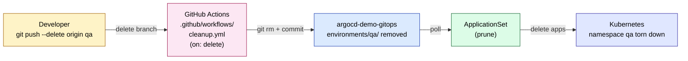

# argocd-demo

Branch-driven GitOps on Kubernetes. Push a branch → an environment provisions itself. Delete a branch → the environment tears itself down. **Zero manual ArgoCD work after the one-time setup.**

This repo is the **source of truth** for the application code, Helm chart, raw manifests, cluster bootstrap, and the GitHub Actions pipeline. Per-environment Kubernetes manifests live in a separate repo: [`argocd-demo-gitops`](https://github.com/erchetansoni/argocd-demo-gitops) (the GitOps repo ArgoCD watches).

---

## How a branch becomes an environment

```mermaid
flowchart LR
    Dev["Developer<br/>git push origin qa"]:::user
    SrcRepo["argocd-demo<br/>(this repo)"]:::repo
    CI["GitHub Actions<br/>.github/workflows/<br/>deploy.yml"]:::ci
    GitOps["argocd-demo-gitops<br/>environments/qa/<br/>{app1,app2,app3}/"]:::repo
    AppSet["ArgoCD ApplicationSet<br/>matrix: dirs × apps"]:::argo
    Apps["qa-app1 · qa-app2 · qa-app3<br/>(3 Applications)"]:::argo
    K8s["Kubernetes<br/>namespace: qa"]:::k8s

    Dev -->|push| SrcRepo
    SrcRepo -->|on push| CI
    CI -->|render + commit<br/>bump submodule| GitOps
    GitOps -->|poll| AppSet
    AppSet -->|generate| Apps
    Apps -->|sync| K8s

    classDef user fill:#fef3c7,stroke:#a16207,color:#000
    classDef repo fill:#dbeafe,stroke:#1e40af,color:#000
    classDef ci fill:#fce7f3,stroke:#9d174d,color:#000
    classDef argo fill:#dcfce7,stroke:#166534,color:#000
    classDef k8s fill:#e0e7ff,stroke:#3730a3,color:#000
```





---

## Branch → environment mapping

| Branch | Action | Environment | Namespace | Hosts |
|---|---|---|---|---|
| `main` | deploy | `production` | `main` | `app{1,2,3}.chetan.com` |
| `dev` | deploy | `development` | `dev` | `app{1,2,3}.dev.chetan.com` |
| `stage` | deploy | `stage` | `stage` | `app{1,2,3}.stage.chetan.com` |
| `it` | deploy | `information-technology` | `it` | `app{1,2,3}.it.chetan.com` |
| `qa`, `demo`, … (no `/`) | deploy | `<branch>` | `<branch>` | `app{1,2,3}.<branch>.chetan.com` |
| `feature/*`, `bug/*`, anything containing `/` | **skip** | — | — | — |

---

## Repo layout

```
.
├── apps/                      # Application source (referenced from gitops repo via submodule)
│   ├── app1/                  # Helm chart (used by <env>-app1 Applications)
│   │   ├── Chart.yaml
│   │   ├── values.yaml
│   │   └── templates/
│   ├── app2/                  # Raw manifests + kustomization.yaml
│   └── app3/                  # Raw manifests + kustomization.yaml
├── aws-secrets-manager/       # AWS secret bootstrap scripts
├── k8s-cluster-setup/         # kind + nginx + ArgoCD + ESO bootstrap
├── platform/argocd/           # ArgoCD config (ingress, cmd-params)
└── .github/
    ├── workflows/
    │   ├── deploy.yml         # on push: render env folder + push to gitops repo
    │   └── cleanup.yml        # on branch delete: rm env folder + push
    ├── scripts/
    │   └── render-env.sh      # envsubst over .tpl files
    └── templates/
        ├── app1/
        │   ├── kustomization.yaml.tpl
        │   └── values.yaml.tpl
        ├── app2/kustomization.yaml.tpl
        └── app3/kustomization.yaml.tpl
```

The companion **gitops repo** layout (one folder per branch, written by CI):

```
argocd-demo-gitops/
├── _source/                                  # submodule -> argocd-demo (advanced by CI to source HEAD)
├── applicationset.yaml                       # the only ApplicationSet
├── argocd-cm-patch.yaml                      # one-time configmap patch
└── environments/
    ├── main/
    │   ├── app1/  (kustomization.yaml + values.yaml)
    │   ├── app2/  (kustomization.yaml — raw + ingress patch)
    │   └── app3/  (kustomization.yaml — raw + ingress patch)
    └── <other branches>/...
```

---

## How a single Application gets rendered

ArgoCD pulls the gitops repo (with submodule). For `qa-app1`, the source path is `environments/qa/app1/`. Inside, the kustomization references the chart via the submodule:

```yaml
# environments/qa/app1/kustomization.yaml
namespace: qa
helmGlobals:
  chartHome: ../../../_source/apps          # -> resolves to apps/app1 in source repo
helmCharts:
  - name: app1
    releaseName: app1
    valuesFile: values.yaml                  # per-env values
    namespace: qa
```

For `qa-app2` / `qa-app3`, the kustomization pulls in the raw manifest dirs and patches the ingress host:

```yaml
# environments/qa/app2/kustomization.yaml
namespace: qa
resources:
  - ../../../_source/apps/app2
patches:
  - target: { kind: Ingress, name: app2-ingress }
    patch: |
      - op: replace
        path: /spec/rules/0/host
        value: app2.qa.chetan.com
```

The submodule pointer is **bumped to the source-repo SHA on every CI run**, so ArgoCD always sees the chart/manifests as they existed at the commit that triggered the pipeline.

---

## Why this shape (and what's *not* mandatory)

| Choice | Why | Mandatory? |
|---|---|---|
| Two repos (source + gitops) | Standard GitOps pattern; CI in source pushes to gitops without infinite loops; ArgoCD watches one well-defined source of truth | No, but recommended |
| Submodule | Lets the gitops repo reference the chart/manifests without copying. Per-CI-run pointer bump pins the source state | No — could also pre-render everything in CI |
| Kustomize wrapper per app | Cleanly mixes Helm (app1) + raw manifests (app2/app3) without converting everything to charts | No — pure-Helm or pre-rendered YAML also works |
| Matrix ApplicationSet | One Application per (env × app) instead of bundling. Each app has its own status in the ArgoCD UI | No — directory generator + a wrapper kustomization also works |
| ClusterSecretStore (creds Secret in `external-secrets` ns) | One AWS creds Secret usable by ExternalSecrets in **any** namespace, never lands in git | Required — GitHub push protection blocks creds-in-git |

---

## One-time setup

> Source repo: `git@github.com:erchetansoni/argocd-demo.git`
> GitOps repo: `git@github.com:erchetansoni/argocd-demo-gitops.git`

### 1. Source repo secrets

In **argocd-demo** → Settings → Actions → Secrets:

| Secret | Value |
|---|---|
| `GITOPS_TOKEN` | Fine-grained PAT with `Contents: Read & Write` on `argocd-demo-gitops` |

### 2. Cluster

```bash
# Bring up kind + nginx + ArgoCD + ESO (chained inside one script).
./k8s-cluster-setup/create-cluster.sh

# Enable Helm-in-Kustomize and allow loading from outside the kustomization root.
kubectl patch configmap argocd-cm -n argocd --type merge -p \
  '{"data":{"kustomize.buildOptions":"--enable-helm --load-restrictor=LoadRestrictionsNone"}}'
kubectl rollout restart deploy/argocd-repo-server -n argocd

# Create the AWS creds Secret + ClusterSecretStore (one-time).
./aws-secrets-manager/create-k8s-aws-credentials-secret.sh
```

### 3. GitOps repo (one-time)

```bash
git clone git@github.com:erchetansoni/argocd-demo-gitops.git
cd argocd-demo-gitops
git submodule add -b main https://github.com/erchetansoni/argocd-demo.git _source
# Add applicationset.yaml + argocd-cm-patch.yaml at the root, commit, push.
```

### 4. Apply the ApplicationSet

```bash
kubectl apply -f /path/to/argocd-demo-gitops/applicationset.yaml
```

After this, **never edit `environments/<branch>/` by hand** — those folders are owned by CI.

---

## Day-to-day usage

### Provision a new environment
```bash
git checkout -b qa
git commit --allow-empty -m "feat(qa): provision qa environment"
git push -u origin qa
# ~30s later: namespace `qa` exists, qa-app1 / qa-app2 / qa-app3 are Synced + Healthy
```

### Tear it down
```bash
git push --delete origin qa
# cleanup.yml fires, removes environments/qa/ from the gitops repo,
# ApplicationSet auto-prunes qa-app1, qa-app2, qa-app3, namespace qa goes away.
```

### Update app code
Push to any valid branch (or `main`). CI re-renders that env's folder and bumps the submodule pointer to your commit. ArgoCD reconciles within a poll interval (~3 min default; force with `kubectl annotate application <name> -n argocd argocd.argoproj.io/refresh=hard --overwrite`).

---

## Validation

```bash
# Applications (one per env × app)
kubectl get applications -n argocd

# Per-namespace resources
kubectl get pods,svc,ingress,externalsecret -n main
kubectl get pods,svc,ingress,externalsecret -n qa

# ESO: creds + cluster store
kubectl get secret aws-secretsmanager-credentials -n external-secrets
kubectl get clustersecretstore aws-secretsmanager
```

---

## Loop prevention (why CI doesn't trigger itself)

1. CI runs only on the source repo; commits land in a *different* repo (the gitops repo).
2. Every CI commit message ends with `[skip ci]`.
3. The render script wipes the env folder before re-rendering, so commits are minimal and idempotent.

---

## Future work (deferred)

- Replace plain creds Secret with **SealedSecrets** or **SOPS** so even the cluster-side creds are encrypted at rest.
- Per-branch source pinning via ArgoCD multi-source Applications (each env tracks its own source-repo branch instead of all envs sharing one submodule pointer).
- TLS on ingresses via cert-manager.
